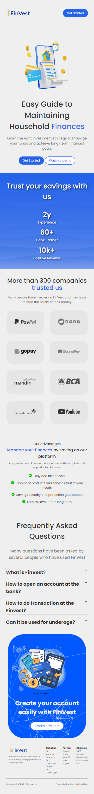
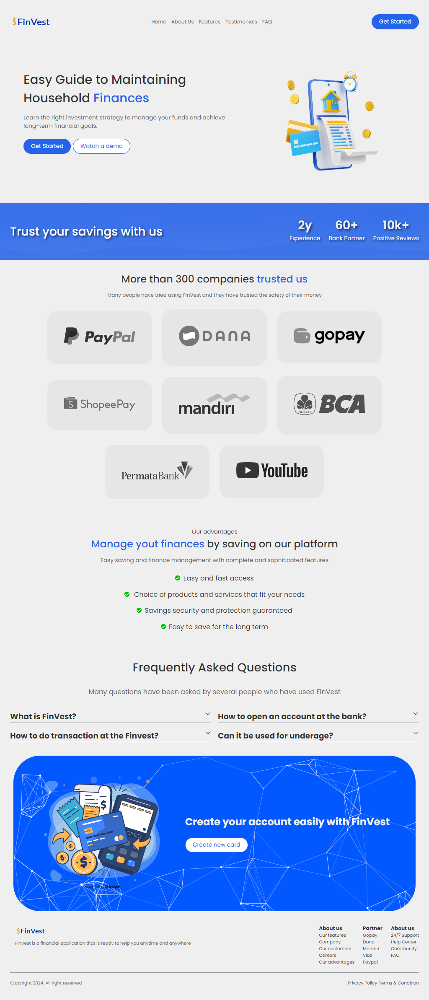

# Finvest

## Description

This landing page showcases a fictional banking company offering financial services and products. It targets users in Indonesia seeking a modern and convenient banking experience.

See demo [here](https://finvest-id.netlify.app/) or [freedcode.shop](https://freedcode.shop)

## Contents

-   **Header**: The header section contains the webpage title "FinVest" and navigation links to other webpage sections like "Home," "About Us," "Features," "Testimonials," and "FAQ." It also includes a call to action button "Get Started."
-   **Hero Section**: The hero section displays the title "Easy Guide to Maintaining Household Finances" with a subtitle "Learn the right investment strategy to manage your funds and achieve long-term financial goals." It also includes two CTAs: "Get Started" and "Watch a demo."
-   **Statistics Section**: This section showcases positive reviews (2Y+), a high number of users (60K+), and the number of trusted partners (10K+).
-   **Trust Section**: This section promotes trust with logos of well-known payment platforms (PayPal, DANA, gopay, Shopee Pay) and banks (BCA, Youtube, Mandiri, PermataBank).
-   **Our Advantages Section**: This section highlights the benefits of using the platform, including managing finances, easy and fast access, customizable options, security and protection, and ease of saving for the long term.
-   **FAQ Section**: A section with the title "Frequently Asked Questions" is included, but the specific questions are not shown until user trigger accorion element.

## Getting Started

To get started with the FinVest website, simply clone this repository to your local machine and open the `index.html` file in your web browser.

```bash
git clone https://github.com/RevoU-FSSE-4/milestone-1-iyefreedy
cd milestone-1-iyefreedy
```

## Preview

Mobile



Desktop


